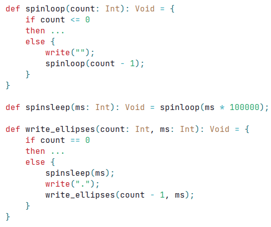
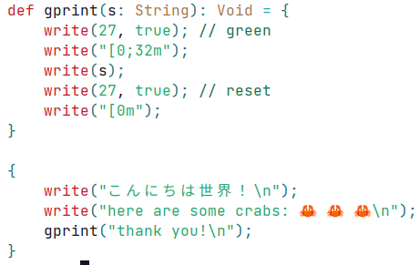

# Funlang 

'Fun', also known as funlang is a fun functional language that I made as 
part of my compilers course at university. The requirements were to 
generate a plaintext llvm-ir file, hence why I am doing this instead of 
other, better methods. If you're good at LLVM you'll probably notice that 
the programs emit buggy LLVM. Let me know so I can fix it. 

Although this is a uni project, there's so much stuff in it that's not part
of the spec to make this a proper compiler. Write some programs in it :)!

## Some Notes About This Repository

I can't fork the original, because I don't have access to the organisation's
settings. I can't even clone after the due date... As a result, I had to 
recommit everything.

## Types

Funlang only has primitive types. These are

- `Callable(P1, P2, P3, ...) -> R` A type that evaluates to `R`, given a 
  number of parameters. Not a function pointer.
- `Int` A 32-bit signed integer e.g. `0`, `-15` or `100_000` or even `'a'` or 
  `'あ'`. Characters are stored as unicode codepoints.
- `Double` A 64-bit floating point number e.g. `0.0, -15.` or `10_000.5`
- `String` A utf8 static string e.g. `"Hello, world!"` or `"こんにちは世界！"`. 
- `Bool` A boolean `true` or `false`
- `Void` Nothing type `...`

## Link with C

Fun cannot be linked with C at the moment. Everything uses `fastcc` to allow 
for `tail call`s to work. Maybe in the future...

## Builtins

Funlang has several intrinsic functions, which have keyword identifiers. 

- `write(String): Void` Print a utf8 string's contents
- `write(Int, true): Void` Print an integer as a character
- `write(Int, false): Void` Print an integer
- `write(Double): Void` Print a double
- There is no `write(Bool)`, you can simply define it yourself

`write` will always flush to stdout.

Rather than having a builtin do-nothing function `skip`, we use `...` -- the 
`Void` literal for expressions that evaluate to nothing

## Example Code

Fun has utf8 strings!

