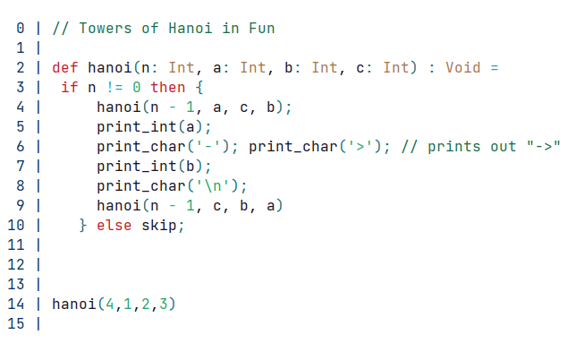
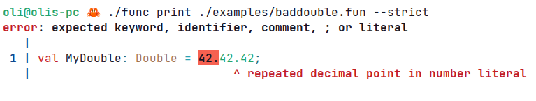
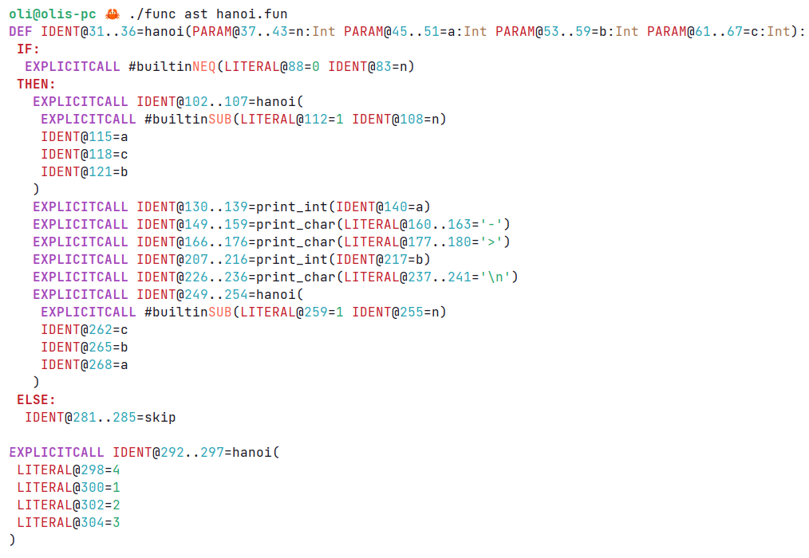
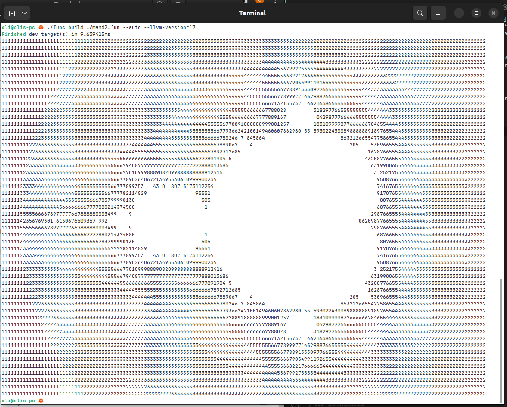
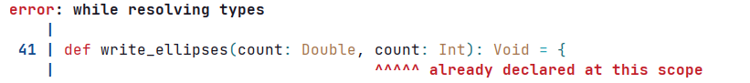
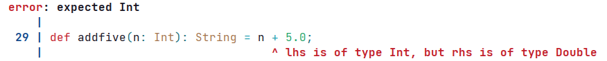

# `func` User Guide

A simple functional programming language, with syntax inspired by Scala... I 
think. I didn't invent the language.

## I Don't Have Time to Read All That

That's okay! To compile a `.fun` program simply `cd` into `cw05`. The do one 
of the below commands. If you want to produce a `func` binary, you can follow
the instructions [here](#installation).

### Just Emit `.ll`

```sh
cargo run --release -- build <FUN> --ll <LL>
```

Where `<FUN>` is the input file and `<LL>` is the output file.

### Build & Run

```sh
cargo run --release -- build ../<filename>.fun --auto 
```

You really should include the `./`. This will:

1. 'Statically link' your file with `funstd/funstd.fun`

2. **Generate `<filename>.ll`** containing the llvm-ir for your file

3. **Generate `<filename>`** containing the binary compiled with `opt`. My
   programs are only tested with `opt-17`, if you have this installed you can
   optionally **specify the llvm version you want to compile with**. Use
   `--llvm-version=17`. It is likely that you will get errors if you are using a
   version earlier than 17, as `ptr` is not available for these versions.

4. **Run the program** if you are on macos or linux* 

*only tested on Linux. The command relies on `chmod`.  

## Installation

`func` is the compiler for the `fun` language. To install it, you can use the
`funup/funup.sh` provided for your convenience, this will create a `func` binary in this directory.

**Nothing will be modified outside of the repository structure**. The script is
very simple and I encourage you to read it.

```sh
$ sh funup/funup.sh
$ ./func help
```

If you do not want to use `funup`, you can use the regular `cargo` build
system. Wherever `func` is used in the future, just replace it with

```sh
cargo run --release -- 
```

trailing `--` is required. For example `func --help` would be 
`cargo run --release -- --help`.

## Features 

`func help` should be descriptive enough, but I detail each command here, just
for extra help!

1. [Syntax Highlighting](#func-print)
2. [View AST](#func-ast)
3. [Typecheck, Compile and Run](#func-build)

### `func print`

Print a file with syntax highlighting. This only invokes the lexer, which is 
very fast, lexing the provided `fun` programs in around 25 microseconds each.

#### Example

```sh
$ func print ./sqr.fun --strict
```



`--strict` mode only allows valid syntax and will print an error, if there is 
invalid syntax somewhere. It tries to highlight roughly where the error is,
as well as give you a (potentially) helpful suggestion as to what might have 
gone wrong. It's not quite right with guessing what you wanted to write though,
often...

```sh
$ func print ./examples/baddouble.fun --strict
```



### `func ast`

Print the abstract syntax tree of a func file. This is not type checked! For 
typechecking, use `func typecheck` or `func build`. Syntax errors in `func` are
generally very bad. I use some terrible heuristics to figure out what the most
fitting syntax error is, but it often just ends up telling you someting 
irrelevant.

```sh
$ func ast hanoi.fun
```



As you can see, I am taking heavy inspiration from a lot of syntactic decisions
made by the rust team... but who can blame me? You read `IDENT@31..36=hanoi` as 
"an identifier that spans the byte range `31..36`, with text value `hanoi`".

There are some limitations with this representation, namely that `def`s are 
always inline... It's also not *technically* an AST representation, but I think 
it's much more readable (and ecncodes the same information), so it's fine.

### `func build`

Build a `.fun` file, producing some `.ll` output file and optionally other
target(s).

This will also **typecheck your program**! How awesome! There are a few
different options for `build`, but the easiest way to build a program is with
`--auto`. For me, I also specify `--llvm-version=17`.



#### `--nostd`

By default, to make the life of the marker easier, programs are compiled with
`funstd.fun`. The source can be found in the `/funstd` folder. However, if you
don't want to use this library, you can pass `--nostd`.

#### `--ll`

Specify the output llvm-ir file for this compilation. A compilation that only 
produces `.ll` would be something like

```sh
func build foo.fun --ll foo.ll
```

#### `--bin`

Specify and option binary target that is compiled with `opt`.

#### Example Type Errors



And another... 


